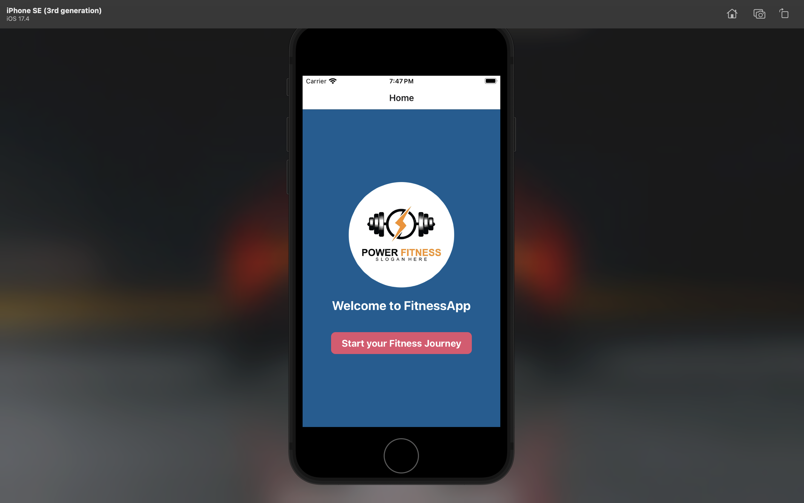

# Fitness-Tracker-App

### Personal Mobile App Project Final

### Name of the Students
1. Varun Reddy Patel
2. Esha Jahnavi Saride

# App Overview

This fitness tracker app is aimed at tracking daily calorie intake and workouts. We developed this app to address the challenge of monitoring daily calorie consumption and exercise routines, which we found challenging on a day-to-day basis. The app is tailored for regular use and offers significant benefits in tracking and recording daily calorie intake. Built using React Native, it leverages various libraries including React Navigation for seamless navigation and Ionicons for iconography. The app comprises two main screens: the HomeScreen for initiating the fitness journey and the AddDayScreen for inputting daily calorie intake and deducting calories through workout options. Users can view a list of previous entries displaying the remaining calories for each day, aiding in progress tracking. AsyncStorage ensures data persistence, enhancing user experience. Overall, it provides users with an intuitive solution for monitoring their fitness progress and achieving their health goals effectively.

# Screenshots of the working App

### 1. Home Screen

  This is the main screen of the app which shows Welcome to FitnessApp! Start your fitness journey by tracking your calories and workouts.




### 2. Add a new day screen:

  Record your daily progress by adding a new day, where you can input your calorie intake and track your activities.


### 3. Adding Calories Screen:

  Easily add your daily calorie intake from food and workouts to stay on top of your fitness goals.


### 4. Workout Tracking:

  Track your workouts, whether it's weightlifting, soccer, running, or other activities, and adjust your calorie intake accordingly and submit your values.


### 5. Progress Tracking:

  Here, users can view their progress over time, including their daily calorie intake and workout achievements you can view your previously recorded data in the add new day screen.


## Required Dependencies

```
  "@react-native-async-storage/async-storage": "1.21.0",
    "@react-navigation/native": "^6.1.17",
    "@react-navigation/native-stack": "^6.9.26",
    "@react-navigation/stack": "^6.3.29",
    "expo": "~50.0.14",
    "expo-status-bar": "~1.11.1",
    "react": "18.2.0",
    "react-native": "0.73.6",
    "react-native-safe-area-context": "4.8.2",
    "react-native-screens": "~3.29.0"
```
